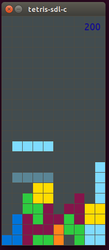

# crystal-tetris
port of Dashed/tetris-sdl-c to crystal-lang


## Prerequisites
* libsdl2
* libsdl2-gfx
* libsdl2-ttf

```
sudo apt-get install libsdl2-dev libsdl2-gfx-dev libsdl2-ttf-dev
```
```
brew install sdl2 sdl2_gfx sdl2_ttf
```

## How to Build
```
crystal deps
crystal tetris.cr
```
